# Chapter 5: 誤差逆伝播法

重みパラメータに関する損失関数の勾配ー計算方法

- 数値微分（4章）
  - 実装は簡単
  - 計算に時間がかかる
- 誤差逆伝播法（5章）
  - 計算を効率よく行える

誤差逆伝播法の理解の仕方

- 数式
- 計算グラフ → これから見ていく

## 5.1 計算グラフ

計算グラフ ... 計算の過程をグラフによって表したもの

- 複数のノードとエッジ(ノード間を結ぶ直線)によって表現される
  - ノード：◯で表記し、◯の中に演算内容を書く
  - エッジ(矢印)：データの流れ。矢印の上部に計算の途中結果を書く

### 5.1.1 計算グラフで解く

計算グラフを使って問題を解くには、

1. 計算グラフを構築する

2. 計算グラフ上で計算を左から右へ進める(**順伝播**) \
   ※逆伝播：右(終着点)から左(出発点)へ計算を進めていくこと

### 5.1.2 局所的な計算

計算グラフの特徴 ... 「局所的な計算」を伝播することで最終的な結果を得られる

「局所的な計算」とは？

- 全体によらず、「自分に関する情報」だけから次の結果を出力できる
- 例：スーパーで、1個100円のりんご2個と他4000円のものを買った（p126 図5-4参照）
  - 合計金額の計算 ... 200 + 4000 = 4200
    - 4000円がどう計算されてきたかは考えず、ただ2つの値を足せば良い→各ノードにおける計算は局所的な計算である

### 5.1.3 なぜ計算グラフで解くのか？

計算グラフの利点

- 局所的な計算
  - 問題の単純化（全体がどんなに複雑な計算でも、各ノードでは単純な計算にできる）
- 途中計算の結果を全て保持することができる
  - 例：りんご2個まで計算した金額は200円、消費税を加算する前の金額は650円
- 逆方向の伝播によって「微分」を効率良く計算できる

「問1：リンゴ2個の買い物」について考える

Q. りんごの値段(apple)が値上がりした場合、最終的な支払い金額(price)にどう影響する？

> →「りんごの値段に関する支払い金額の微分（$\frac{\partial price}{\partial apple}$）」を求めることに相当（りんごの値段が"少しだけ"値上がりした場合に、支払金額がどれだけ増加するか）
>
> ↓　計算グラフの逆伝播で求められる　※やり方は5.2節で学ぶ
>
> 逆伝播の計算グラフより、$\frac{\partial price}{\partial apple}$は2.2（りんごが1円値上がりしたら、最終的な支払金額が2.2円増加）

※「消費税に関する支払金額の微分（$\frac{\partial price}{\partial tax}$）」や「りんごの個数に関する支払金額の微分（$\frac{\partial price}{\partial apple_num}$）」も同様に求められる

## 5.2 連鎖律

逆伝播の「局所的な微分」を伝達する原理は**連鎖律**によるもの

### 5.2.1 計算グラフの逆伝播

逆伝播の計算手順 ... 信号Eに対して、ノードの局所的な微分(∂y/∂x)を乗算して、次のノードへ伝達していく

順伝播：

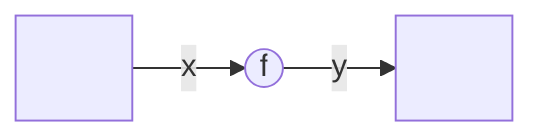

逆伝播：

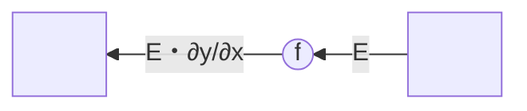

### 5.2.2 連鎖律とは

連鎖律 ... 合成関数の微分についての性質

- 合成関数 ... 複数の関数によって構成される関数のこと \
  例) $z = (x + y)^2$ は、$z = t^2$ と $t = x + y$ で構成される

- 連鎖律の原理 ... ある関数が合成関数で表される場合、合成関数の微分は、構成するそれぞれの関数の微分の積で表せる
  $$\frac{\partial z}{\partial x} = \frac{\partial z}{\partial t} \frac{\partial t}{\partial x} = 2t・1 = 2(x+y)$$

### 5.2.3 連鎖律と計算グラフ

計算グラフの逆伝播は連鎖律によって成り立つ

1. 計算式（$z = (x + y)^2$）から計算グラフを作成

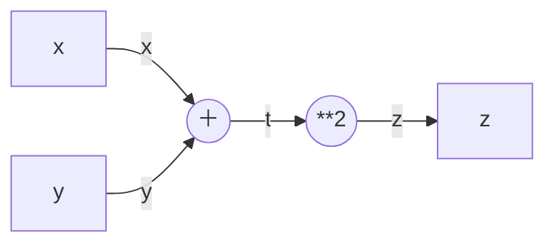

2. 逆伝播の計算をする
   - 一番左の逆伝播の結果 ... $\frac{\partial z}{\partial x}$（xに関するzの微分）に対応
   - 逆伝播が行なっていることは、連鎖律の原理から構成されている

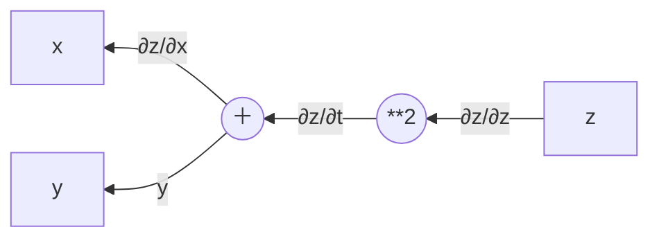

$$\frac{\partial z}{\partial t} = \frac{\partial z}{\partial z} \frac{\partial z}{\partial t} = 1・2t = 2(x+y)$$
$$\frac{\partial z}{\partial x} = \frac{\partial z}{\partial z} \frac{\partial z}{\partial t} \frac{\partial t}{\partial x} = 2(x+y)・1 = 2(x+y)$$

## 5.3 逆伝播

逆伝播の仕組みについて説明

### 5.3.1 加算ノードの逆伝播

z = x + y の式について考える \
加算ノードの逆伝播 ... (1を乗算するだけなので、) 入力された値をそのまま次のノードへ流すだけ

順伝播：

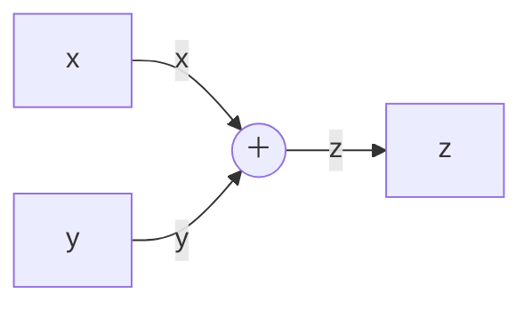

逆伝播：

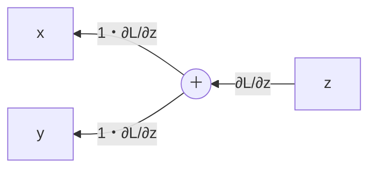

※「zに対するLの微分」としているのは、最終的にLという値を出力する大きな計算グラフを想定している為

### 5.3.2 乗算ノードの逆伝播

z = xy の式について考える \
乗算の逆伝播 ... 上流の値に、順伝播の際の入力信号を"ひっくり返した値"を乗算して下流へ流す
順伝播：

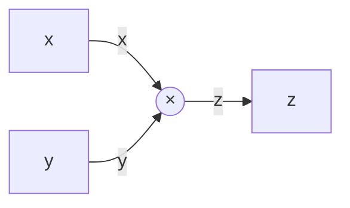

逆伝播：

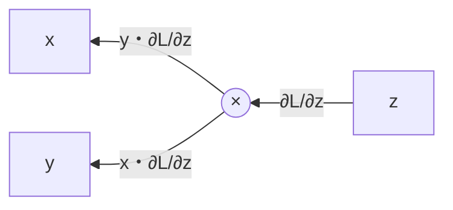

### 5.3.3 リンゴの例

### 問1 リンゴ2個の買い物 (p.124)

太郎くんはスーパーで1個100円のリンゴを2個買いました。支払う金額を求めなさい。ただし、消費税が10%適用されるものとします。

順伝播：

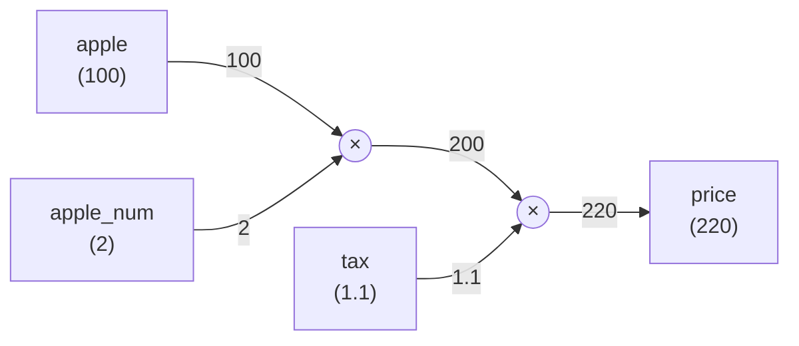

逆伝播：

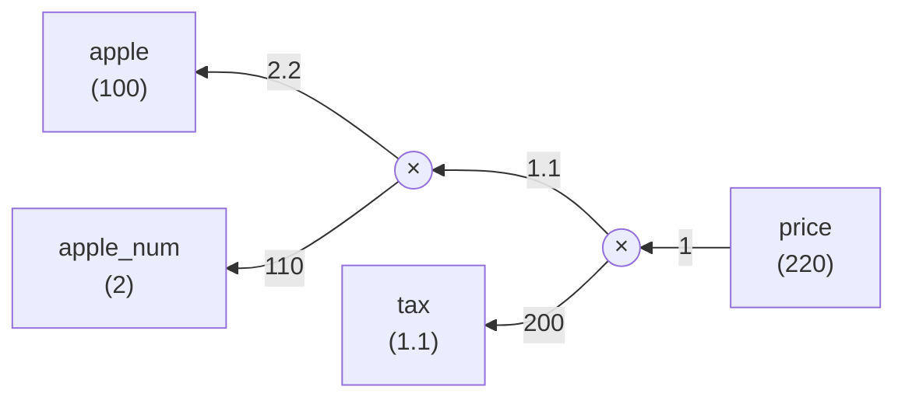

リンゴの値段、リンゴの個数、消費税が最終的な支払金額にどれくらい影響するか

- $\frac{\partial price}{\partial apple}$ = 2.2（リンゴの値段が 1 円上がると、支払金額は 2.2 円上がる）
- $\frac{\partial price}{\partial apple\_num}$ = 110（リンゴの個数が1つ増えると、支払い金額は110円上がる）
- $\frac{\partial price}{\partial tax}$ = 200（消費税が100%上がると、リンゴの値段は200円上がる）
  ※ 消費税とリンゴの値段はスケールが異なるので注意

### 問2 リンゴ2個とみかん3個の買い物 (p.125)

太郎君はスーパーでりんごを2個、みかんを3個買いました。りんごは1個100円、みかんは1個150円です。消費税が10%かかるものとして支払う金額を求めなさい。

順伝播：

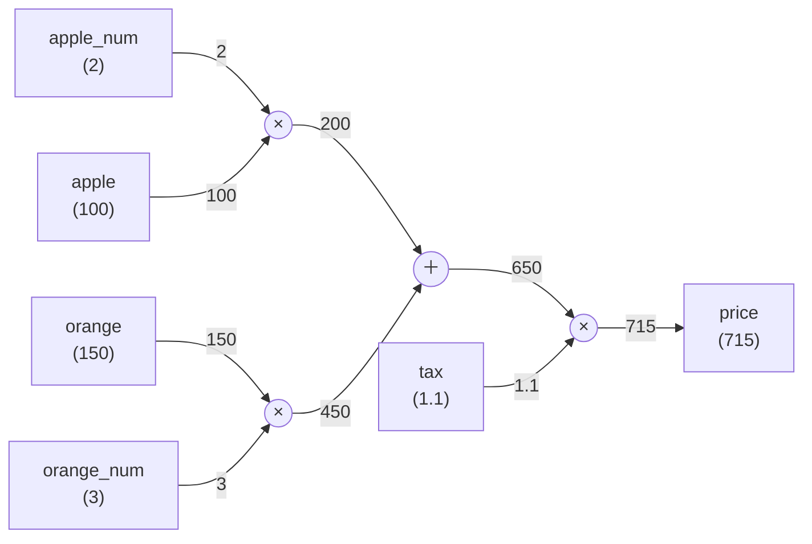

逆伝播：

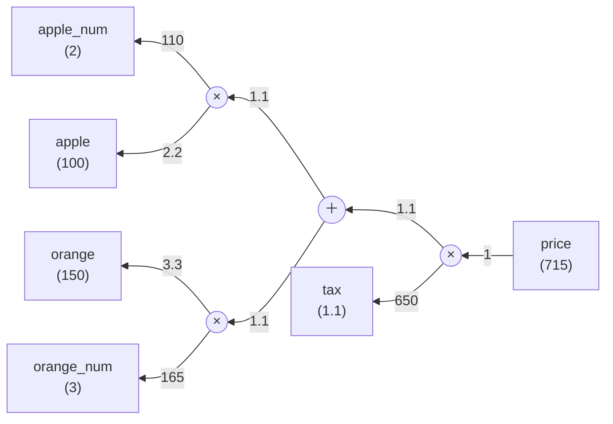
