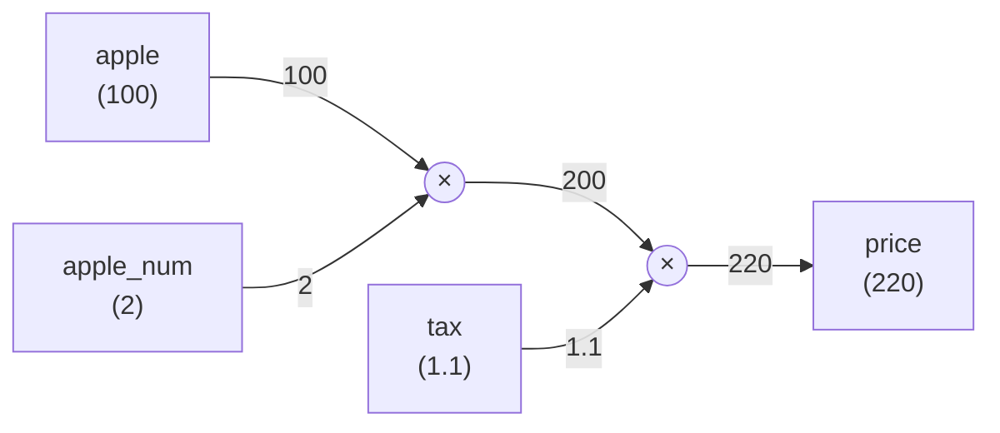
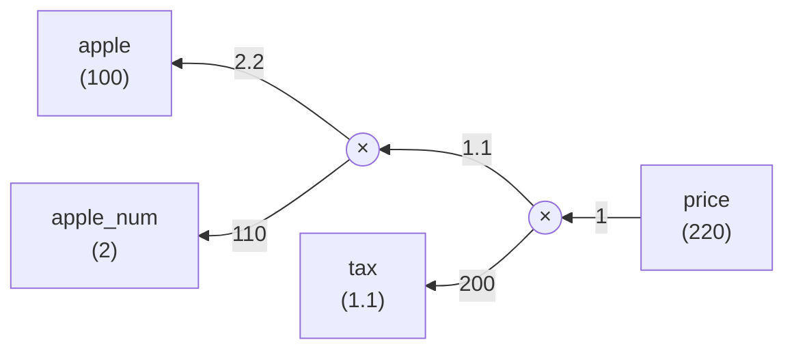

# Chapter 5: 誤差逆伝播法

## 問いと計算グラフ

p.124 \
問1：太郎くんはスーパーで1個100円のリンゴを2個買いました。支払う金額を求めなさい。ただし、消費税が10%適用されるものとします。

順伝播：

```mermaid
flowchart LR
    A["apple<br/>(100)"] -->|100| C(("×"))
    B["apple_num<br/>(2)"] -->|2| C
    C -->|200| D(("×"))
    E["tax<br/>(1.1)"] -->|1.1| D
    D -->|220| F["price<br/>(220)"]
```

逆伝播：

```mermaid
flowchart RL
    C(("×")) --> |2.2| A["apple<br/>(100)"]
    C --> |110| B["apple_num<br/>(2)"]
    D(("×")) --> |1.1| C
    D --> |200| E["tax<br/>(1.1)"]
    F["price<br/>(220)"] --> |1| D
```
