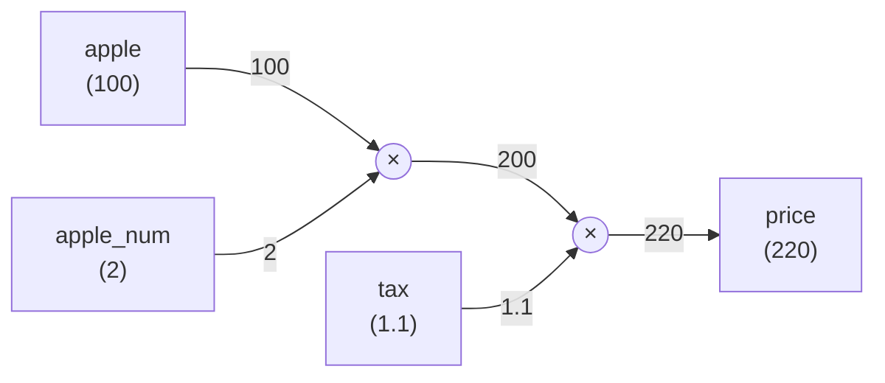
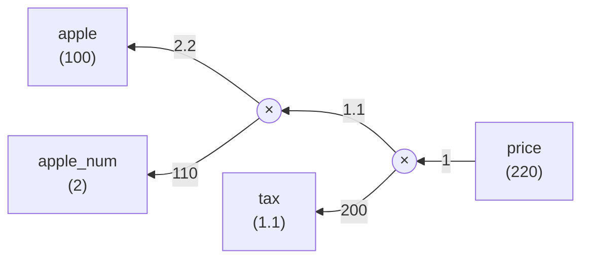
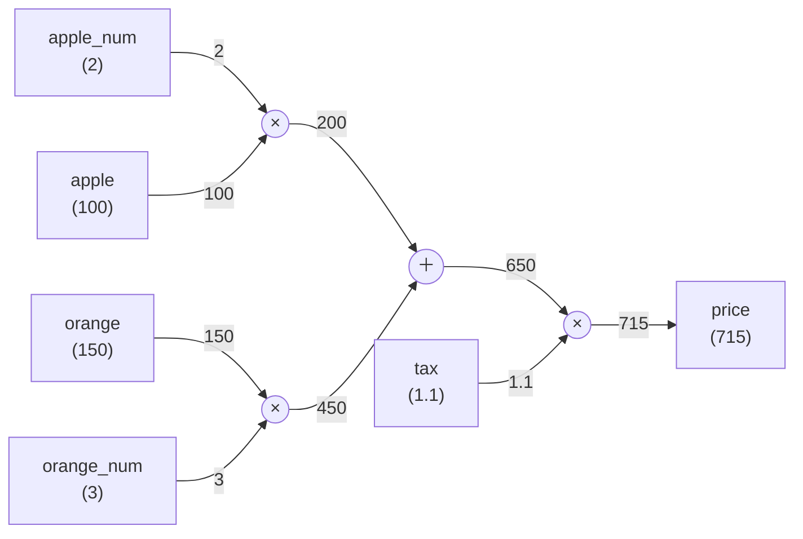
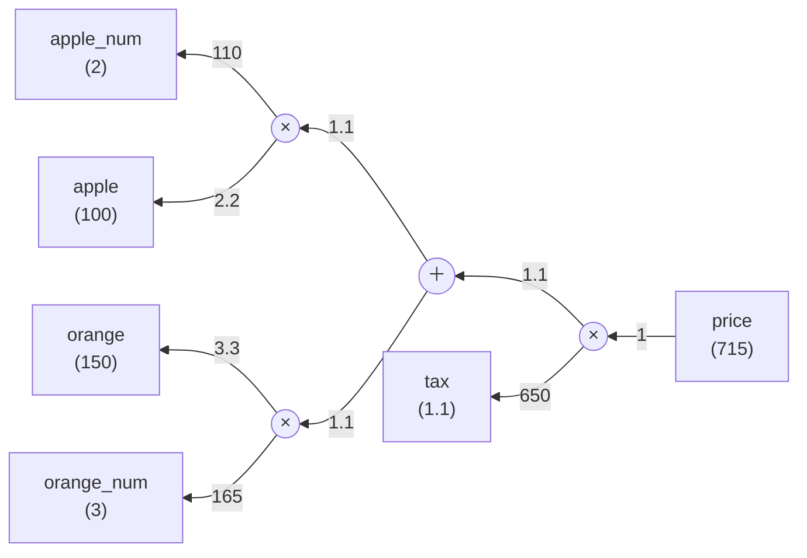

# Chapter 5: 誤差逆伝播法

## 問いと計算グラフ

p.124 \
問1：太郎くんはスーパーで1個100円のリンゴを2個買いました。支払う金額を求めなさい。ただし、消費税が10%適用されるものとします。

順伝播：

逆伝播：

p.125 \
問2：太郎君はスーパーでりんごを2個、みかんを3個買いました。りんごは1個100円、みかんは1個150円です。消費税が10%かかるものとして支払う金額を求めなさい。

順伝播：

逆伝播：

