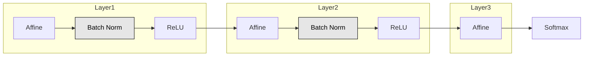

# Chapter 6: 学習に関するテクニック（後半 p.186〜）

## 6章前半の復習

➡️ 後半に影響する部分に絞る
6.2 重みの初期値 \
重みの初期値を適切に設定すれば、各層のアクティベーションの分布は適切な広がりを持ち、学習がスムーズに行える

## 6.3 Batch Normalization

### 6.3.1 Batch Normalizationのアルゴリズム

Batch Normalization ... ミニバッチごとに正規化すること

- Batch(バッチ) ... まとまりのある入力データ（p.79 3.6.3 バッチ処理より）
- Normalization(正規化) ... データの分布を、平均0・分散1に変換すること

ミニバッチの入力データ $B = \{ x_1, x_2, \dots, x_m \}$ を、 \
平均0・分散1のデータ $\hat{B} = \{ \hat{x}_1, \hat{x}_2, \dots, \hat{x}_m \}$ に変換する

1. 平均 $\mu_B$ を求める　　$\mu_B ← \frac{1}{m} \sum_{i=1}^{m} x_i$

2. 分散 $\sigma_B^2$ を求める　　$\sigma_B^2 ← \frac{1}{m} \sum_{i=1}^{m} (x_i - \mu_B)^2$

3. 正規化（平均0、分散1に変換）　　$\hat{x}_i ← \frac{x_i - \mu_B}{\sqrt{\sigma_B^2 + \varepsilon}}$ \
   ※ $\varepsilon$ は、小さな値（例：10e-7など）で、0での除算を防止する為のもの

4. 固有のスケール $\gamma$ とシフト $\beta$ で変換　　$y_i = \gamma \hat{x}_i + \beta$ \
   最初は $\gamma = 1$ とシフト $\beta = 0$ からスタートして、学習によって適した値に調整

利点

- 学習を早く進行させることができる（学習係数を大きくすることができる）
- 初期値にそれほど依存しない（初期値に対してそこまで神経質にならなくて良い）
- 過学習を抑制する（Dropoutなどの必要性を減らす）

➡️ Q. なぜこの処理を行うか / どういう時にこれを使うかの説明
